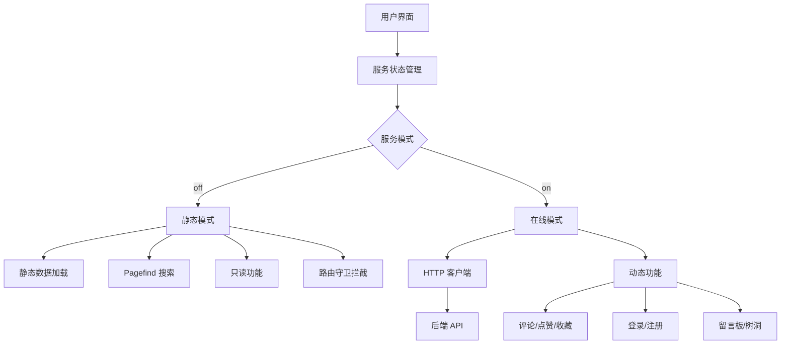
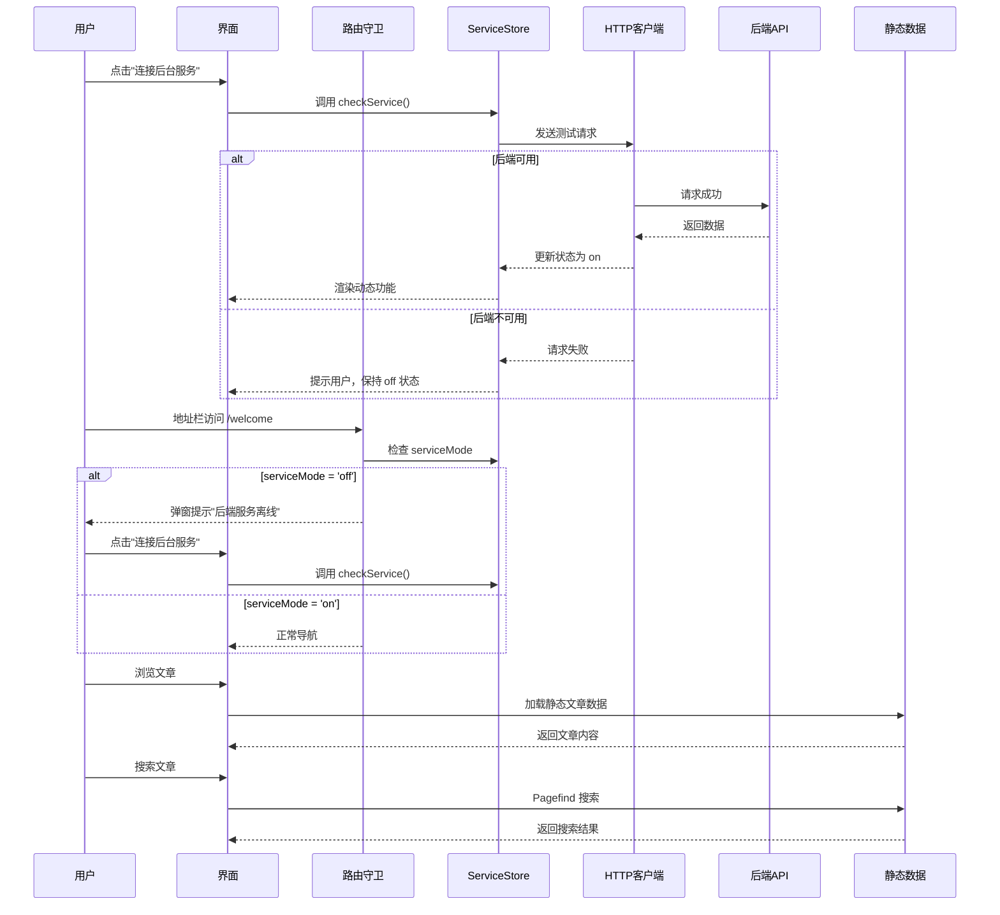

## 产品概述

将 sta-blog-ui 前端项目改造为可独立于后端服务运作的静态博客系统。改造后，前端可以纯静态方式运行，同时通过"连接后台服务"按钮，用户可以手动触发与后端服务的连接，解锁需要后端支持的功能。

## 核心功能

### 1. 静态模式（默认）

- 前端初始以静态模式运行（service:off）
- 全量缓存文章内容到 public/ 目录作为静态资源
- 保留文章阅读、分类查看、标签查看等读操作为主的功能
- **完全禁用所有需要后端支持的功能**：隐藏UI元素，拦截路由访问并弹窗提示

### 2. 后端连接功能

- 首页/导航栏提供"连接后台服务"按钮
- 用户手动点击后，前端尝试连接后端服务
- 连接成功则切换到在线模式（service:on）
- 在线模式下渲染所有需要后端支持的功能元素

### 3. 静态搜索功能

- 使用 Pagefind 实现构建时索引
- 构建阶段自动扫描生成的 HTML 文件
- 生成分片式索引文件，用户访问时仅加载相关索引分片
- 在浏览器内完成全文检索

### 4. 构建时静态数据生成

- 提供 Node.js 脚本，从后端 API 获取全量文章数据
- 生成 JSON 文件保存到 public/ 目录
- 支持文章详情、分类、标签等数据的静态化

### 5. 路由级别拦截（新增）

- 静态模式下，用户通过地址栏直接访问需要后端的页面时
- 弹出提示框："后端服务离线，该功能不可用"
- 提供"连接后台服务"按钮，点击后尝试连接

## 关键约束

1. **渐进式改造**：每个阶段完成后，都要保证原有前后端功能正常（用户会启动后端服务进行测试）
2. **页面正常展示**：不出现空白页或报错，新增的静态模式功能不影响在线模式的使用
3. **路由守卫**：静态模式下拦截所有需要后端支持的路由，并弹窗提示用户

## 技术栈选型

- **前端框架**: Vue 3 + TypeScript（继续使用现有框架）
- **状态管理**: Pinia（新增 service store 模块）
- **构建工具**: Vite（集成 Pagefind 插件）
- **静态搜索**: Pagefind（构建时生成索引，运行时搜索）
- **HTTP 客户端**: Axios（修改拦截器支持离线模式）
- **CSS 框架**: Element Plus + Tailwind CSS（继续使用）

## 实现方案

### 1. 服务状态管理

创建新的 Pinia store 模块 `service.ts`，管理前端服务状态：

- `isServiceAvailable`: Boolean，表示后端服务是否可用
- `isServiceMode`: String，'off' | 'on'，当前服务模式
- `checkService()`: 尝试连接后端服务，更新状态
- `toggleServiceMode()`: 切换服务模式的 UI 状态

**关键决策**: 使用 Pinia 集中管理状态，而非使用 provide/inject 或 event bus，确保状态可预测且易于调试。**默认设置 `serviceMode` 为 'on'**，确保改造过程中现有功能不受影响。

### 2. HTTP 客户端改造

修改 `src/utils/http.ts`，添加离线模式支持：

- 请求拦截器中检查 `serviceStore.isServiceAvailable`
- 如果服务不可用且请求不是静态数据请求，则拒绝请求并提示用户
- 响应拦截器中处理网络错误，自动切换到离线模式

**性能考虑**: 离线模式下不发送网络请求，避免不必要的网络超时等待。

### 3. 静态数据生成脚本

创建 `scripts/generate-static-data.js`，在构建前运行：

- 从后端 API 获取全量文章数据
- 生成 `public/articles/[id].json` 文件
- 生成 `public/categories.json`、`public/tags.json` 等元数据文件
- 生成 Pagefind 索引所需的 HTML 文件

**关键决策**: 使用 Node.js 脚本而非 Vite 插件，因为数据获取逻辑较复杂，且需要错误处理和重试机制。

### 4. Pagefind 集成

在 `vite.config.ts` 中添加 Pagefind 插件：

- 安装 `pagefind` 包
- 在构建完成后运行 Pagefind 索引生成
- 修改 Search 组件，在静态模式下使用 Pagefind API 进行搜索

**性能考虑**: Pagefind 生成分片式索引，用户搜索时仅加载相关分片，性能优异。

### 5. 组件条件渲染

修改以下组件，根据 `serviceStore.isServiceMode` 条件渲染：

- `src/components/Comment/index.vue` - 评论组件（需要后端）
- `src/views/Article/index.vue` - 文章详情页的点赞/收藏按钮（需要后端）
- `src/components/Layout/Header/index.vue` - 添加"连接后台服务"按钮
- `src/views/Welcome/index.vue` - 登录/注册页面（需要后端，静态模式下隐藏或直接跳转）
- `src/views/Setting/index.vue` - 用户设置页面（需要后端）
- `src/views/Amusement/TreeHole/index.vue` - 树洞页面（需要后端）
- `src/views/Amusement/Message/index.vue` - 留言板页面（需要后端）
- `src/views/Photo/index.vue` - 相册页面（上传功能需要后端，查看功能可静态化）

**实现方式**: 使用 `v-if` 指令结合 `serviceStore.isServiceMode` 进行条件渲染。

### 6. 路由守卫（新增）

修改 `src/router/index.ts`，添加路由守卫：

- 定义需要后端支持的路由白名单：`/welcome`, `/setting`, `/treeHole`, `/message` 等
- 在路由前置守卫 `beforeEach` 中检查 `serviceStore.serviceMode`
- 如果 `serviceMode === 'off'` 且目标路由在白名单中：
- 弹出提示框："后端服务离线，该功能不可用"
- 提供"连接后台服务"按钮
- 取消则重定向到首页

**关键决策**: 使用路由前置守卫而非组件内守卫，确保地址栏直接访问也能被拦截。

## 实现注意事项

### 性能优化

1. **静态数据加载**: 使用动态 import 按需加载文章数据，避免首屏加载所有文章
2. **Pagefind 搜索**: 利用 Pagefind 的分片加载特性，避免一次性加载所有索引
3. **组件懒加载**: 保持现有的路由级懒加载，减少首屏 JS 体积

### 日志记录

1. 复用现有的 `ElMessage` 进行用户提示
2. 服务连接状态变化时在控制台输出日志，便于调试
3. 避免在日志中输出敏感信息（如 Token）

### 向后兼容

1. 保持现有 API 调用方式不变，仅在 HTTP 客户端层添加离线模式支持
2. 新增功能不影响现有在线模式的正常使用
3. 提供配置项，允许强制在线模式（跳过离线检测）

## 架构设计

### 系统架构图



### 数据流图



## 目录结构

### 新增文件

```
sta-blog-ui/
├── scripts/
│   └── generate-static-data.js  # [NEW] 构建时静态数据生成脚本。从后端API获取全量文章数据，生成JSON文件到public/目录，支持文章详情、分类、标签等数据的静态化。应包含错误处理和重试机制。
├── src/
│   └── store/
│       └── modules/
│           └── service.ts       # [NEW] 服务状态管理Store。定义isServiceAvailable、isServiceMode状态，提供checkService()、toggleServiceMode()方法。管理前端服务状态，控制动态功能的显示/隐藏。默认serviceMode为'on'确保向后兼容。
└── public/
    ├── articles/                # [NEW] 静态文章数据目录。存储所有文章的JSON数据文件，按文章ID命名（如1.json、2.json）。由构建脚本自动生成。
    ├── categories.json          # [NEW] 静态分类数据。由构建脚本生成，包含全部分类信息。
    ├── tags.json               # [NEW] 静态标签数据。由构建脚本生成，包含全部标签信息。
    └── pagefind/              # [NEW] Pagefind索引目录。由Pagefind构建时自动生成，包含分片式搜索索引文件。
```

### 修改文件

```
sta-blog-ui/
├── src/
│   ├── utils/
│   │   └── http.ts            # [MODIFY] HTTP客户端改造。添加离线模式支持，请求拦截器中检查serviceStore.isServiceAvailable，响应拦截器中处理网络错误并自动切换到离线模式。确保在线模式不受影响。
│   ├── stores/
│   │   └── modules/
│   │       ├── website.ts     # [MODIFY] 网站信息Store改造。添加静态数据加载逻辑，当服务不可用时从public/目录加载静态数据。
│   │       └── user.ts       # [MODIFY] 用户Store改造。当服务不可用时，用户信息相关功能隐藏或禁用。
│   ├── components/
│   │   ├── Layout/
│   │   │   └── Header/
│   │   │       └── index.vue # [MODIFY] 导航栏改造。添加"连接后台服务"按钮，根据serviceStore.isServiceMode显示/隐藏。按钮点击后调用serviceStore.checkService()。确保在线模式下按钮不显示或显示"后台已连接"。
│   │   ├── Comment/
│   │   │   └── index.vue     # [MODIFY] 评论组件改造。使用v-if="serviceStore.isServiceMode === 'on'"条件渲染，静态模式下不显示评论功能。
│   │   └── Search/
│   │       └── index.vue     # [MODIFY] 搜索组件改造。静态模式下使用Pagefind API进行搜索，在线模式下使用现有后端API搜索。
│   ├── views/
│   │   ├── Article/
│   │   │   └── index.vue     # [MODIFY] 文章详情页改造。点赞、收藏按钮使用v-if="serviceStore.isServiceMode === 'on'"条件渲染。文章详情数据加载逻辑改为优先从静态JSON加载，失败后再尝试API请求。
│   │   ├── Home/
│   │   │   └── Main/
│   │   │       └── index.vue # [MODIFY] 首页改造。可能需要在首页添加"连接后台服务"按钮（如果Header中没有）。
│   │   ├── Welcome/
│   │   │   └── index.vue     # [MODIFY] 登录/注册页面改造。静态模式下隐藏或直接跳转，在线模式下正常显示。添加路由守卫拦截。
│   │   ├── Setting/
│   │   │   └── index.vue     # [MODIFY] 用户设置页面改造。静态模式下隐藏，在线模式下正常显示。添加路由守卫拦截。
│   │   ├── Amusement/
│   │   │   ├── TreeHole/
│   │   │   │   └── index.vue # [MODIFY] 树洞页面改造。静态模式下隐藏发布功能，仅显示静态树洞内容（如果有）。添加路由守卫拦截。
│   │   │   └── Message/
│   │   │       └── index.vue # [MODIFY] 留言板页面改造。静态模式下隐藏发布功能，仅显示静态留言内容（如果有）。添加路由守卫拦截。
│   │   └── Photo/
│   │       └── index.vue     # [MODIFY] 相册页面改造。静态模式下隐藏上传功能，仅显示静态相册内容。添加路由守卫拦截。
│   ├── apis/
│   │   ├── article/
│   │   │   └── index.ts     # [MODIFY] 文章API改造。添加静态数据加载逻辑，当服务不可用时从public/articles/[id].json加载数据。
│   │   └── ...              # [MODIFY] 其他API模块。类似改造，添加离线模式支持。
│   └── router/
│       └── index.ts          # [MODIFY] 路由配置改造。添加路由前置守卫，静态模式下访问需要登录的页面时弹窗提示"后端服务离线"，并提供"连接后台服务"按钮。确保地址栏直接访问也能被拦截。
├── vite.config.ts            # [MODIFY] Vite配置改造。添加Pagefind插件，配置构建时运行静态数据生成脚本。
├── package.json             # [MODIFY] 添加pagefind依赖，添加generate:static脚本。
└── .env.production          # [MODIFY] 生产环境变量。添加VITE_SERVICE_MODE配置项，允许强制在线模式或强制离线模式。
```

## 关键代码结构

### 1. Service Store 接口定义

```typescript
// src/store/modules/service.ts
export const useServiceStore = defineStore('service', () => {
  // 后端服务是否可用
  const isServiceAvailable = ref(false)
  // 当前服务模式：'off' | 'on'
  // 默认为 'on'，确保改造过程中现有功能不受影响
  const serviceMode = ref<'off' | 'on'>('on')
  
  // 检查后端服务是否可用
  const checkService = async () => {
    try {
      // 发送测试请求到后端API
      const response = await axios.get('/api/health')
      if (response.status === 200) {
        isServiceAvailable.value = true
        serviceMode.value = 'on'
        ElMessage.success('后台服务已连接')
      }
    } catch (error) {
      isServiceAvailable.value = false
      serviceMode.value = 'off'
      ElMessage.warning('无法连接后台服务，已切换至静态模式')
    }
  }
  
  // 切换服务模式（仅当服务可用时）
  const toggleServiceMode = () => {
    if (isServiceAvailable.value) {
      serviceMode.value = serviceMode.value === 'on' ? 'off' : 'on'
    } else {
      ElMessage.warning('后台服务不可用，无法切换模式')
    }
  }
  
  return {
    isServiceAvailable,
    serviceMode,
    checkService,
    toggleServiceMode
  }
})
```

### 2. 路由守卫实现

```typescript
// src/router/index.ts
import { useServiceStore } from '@/store/modules/service'

const serviceRequiredRoutes = ['/welcome', '/setting', '/treeHole', '/message', '/photo']

router.beforeEach((to, from, next) => {
  const serviceStore = useServiceStore()
  
  // 检查目标路由是否需要后端服务
  const requiresService = serviceRequiredRoutes.some(route => to.path.startsWith(route))
  
  if (requiresService && serviceStore.serviceMode === 'off') {
    // 弹窗提示后端离线
    ElMessageBox.alert(
      '后端服务离线，该功能不可用。请点击"连接后台服务"按钮尝试连接。',
      '提示',
      {
        confirmButtonText: '确定',
        callback: () => {
          next('/')
        }
      }
    )
  } else {
    next()
  }
})
```

### 3. 静态数据加载工具函数

```typescript
// src/utils/static-data.ts
export const loadStaticArticle = async (id: string): Promise<Article | null> => {
  try {
    const response = await fetch(`/articles/${id}.json`)
    if (response.ok) {
      return await response.json()
    }
    return null
  } catch (error) {
    console.error('加载静态文章数据失败:', error)
    return null
  }
}

export const loadStaticCategories = async (): Promise<Category[]> => {
  try {
    const response = await fetch('/categories.json')
    if (response.ok) {
      return await response.json()
    }
    return []
  } catch (error) {
    console.error('加载静态分类数据失败:', error)
    return []
  }
}

export const loadStaticTags = async (): Promise<Tag[]> => {
  try {
    const response = await fetch('/tags.json')
    if (response.ok) {
      return await response.json()
    }
    return []
  } catch (error) {
    console.error('加载静态标签数据失败:', error)
    return []
  }
}
```

## 设计风格

采用与现有博客一致的设计风格，保持简洁、现代的视觉体验。在导航栏右侧添加"连接后台服务"按钮，按钮样式与现有导航栏元素保持一致。

## 设计内容描述

### 1. 导航栏改造（Header 组件）

- **位置**: 导航栏右侧，日夜切换按钮旁边
- **按钮状态**:
- 静态模式（service:off）：显示"连接后台服务"按钮，使用朴素按钮样式
- 在线模式（service:on）：显示"后台已连接"文本，使用成功色（绿色）标签样式
- 连接中：显示加载动画
- **交互**: 点击按钮后，显示连接状态提示（使用 ElMessage 或 ElNotification）

### 2. 静态模式提示

- 在页面适当位置（如 Footer 上方）显示"当前为静态模式，部分功能不可用"的提示条
- 提示条可关闭，关闭后不再显示（使用 localStorage 记录状态）

### 3. 动态功能隐藏

- 评论区：静态模式下完全隐藏
- 点赞/收藏按钮：静态模式下隐藏或禁用（使用 disabled 样式）
- 登录/注册入口：静态模式下隐藏
- 留言板/树洞发布功能：静态模式下隐藏，仅显示静态内容

### 4. 路由拦截提示

- 使用 Element Plus 的 ElMessageBox 组件
- 提示内容："后端服务离线，该功能不可用。请点击"连接后台服务"按钮尝试连接。"
- 提供"确定"按钮，点击后重定向到首页

### 5. 响应式设计

- 保持现有响应式设计不变
- 移动端下，"连接后台服务"按钮可能显示为图标 + 文字，或仅显示图标