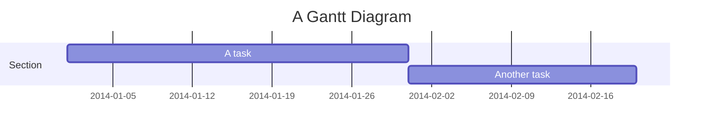
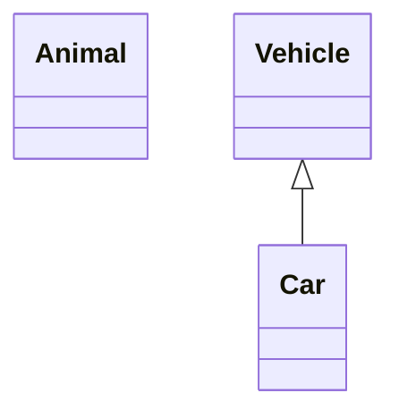

## 这是一篇测试文章
> 你看见这篇文章说明后台发布文章功能成功

```mermaid
gantt
title A Gantt Diagram
dateFormat  YYYY-MM-DD
section Section
A task  :a1, 2014-01-01, 30d
Another task  :after a1, 20d
```

### 图表

```mermaid
classDiagram
  class Animal
  Vehicle <|-- Car
```
